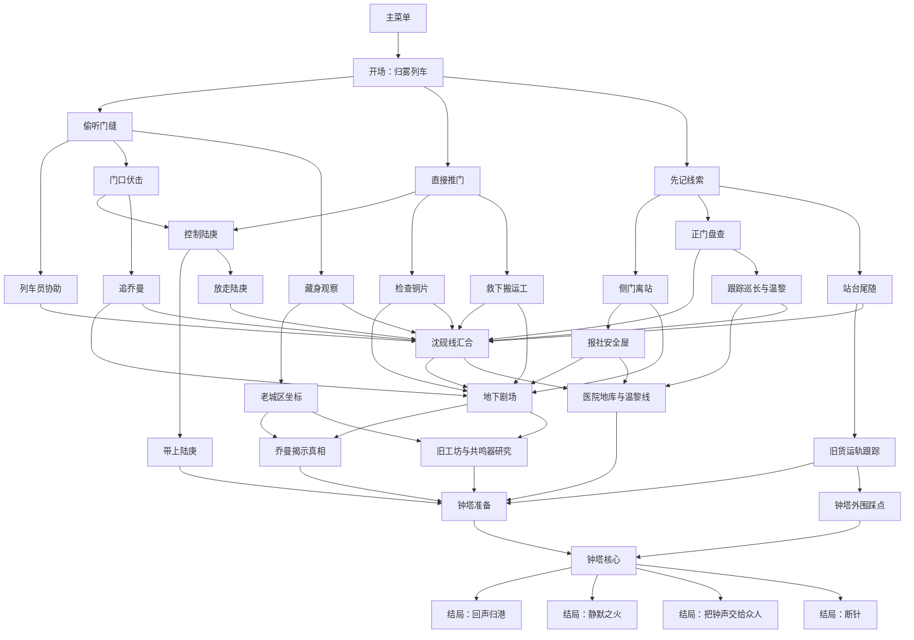
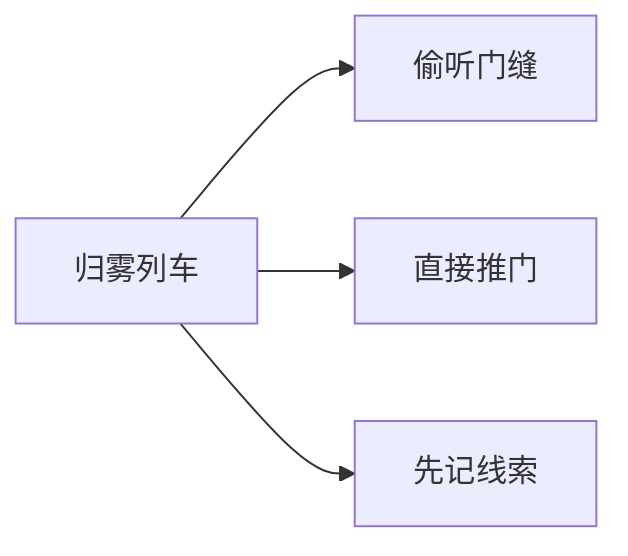
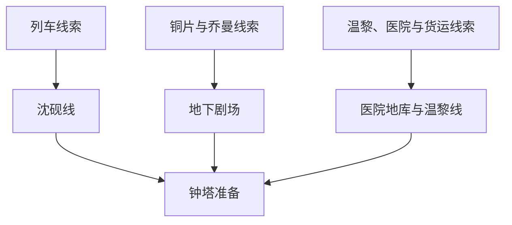
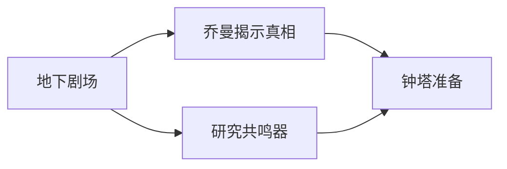
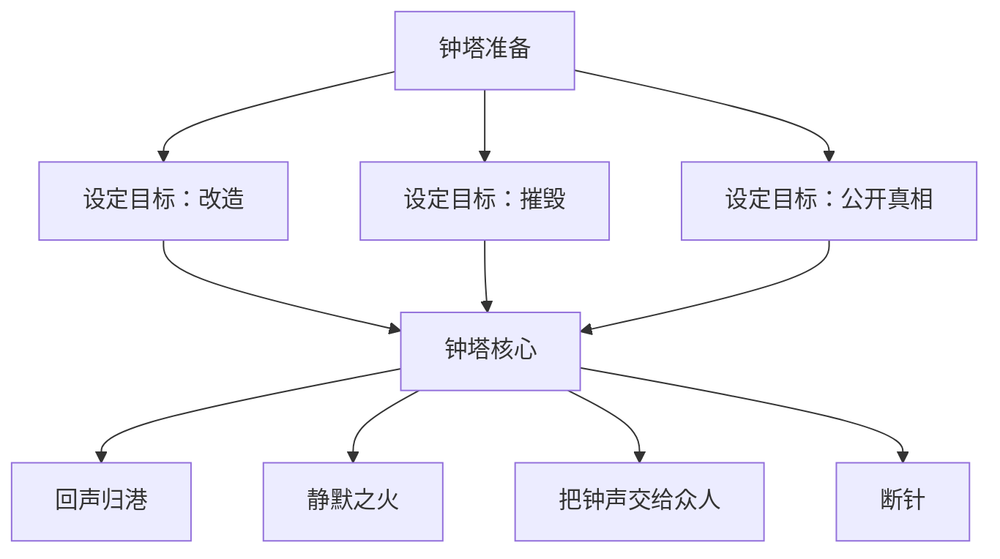
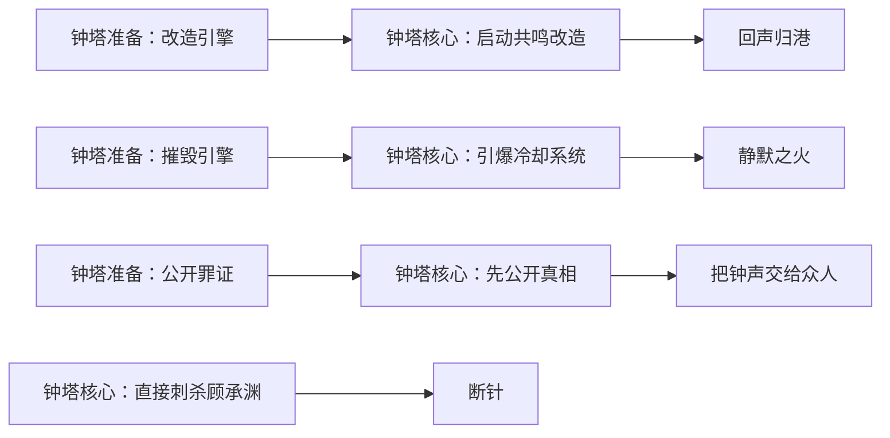

# 雾港回声：剧情流程图

## 总览图

---

## 分阶段流程

### 1. 开场阶段

这一阶段的作用，是把玩家带进雾港的核心矛盾，并通过三种初始调查方式，区分不同的叙事节奏。

- 偷听门缝更偏侦查，会更早接触到晨星引擎与父亲之死的联系。
- 直接推门更偏正面冲突，能更快拿到现场线索和人证。
- 先记线索更偏稳妥推进，会更早接入沈砚和夜航会这条线。

### 2. 中期调查汇合

到了中期，剧情会逐渐从不同入口收束到几条稳定主线。

- 沈砚线负责汇总信息、建立全局认知。
- 地下剧场线负责补全父亲旧案和乔曼的真相。
- 温黎线负责把幕后阴谋落实为一套可验证的执行体系。

虽然切入方式不同，但这几条线最后都会把玩家带向钟塔终局。

### 3. 真相揭露阶段

这一阶段负责完成情绪和信息上的收束。

- 乔曼揭示真相这一步，主要解释人物关系、旧案真相和父亲当年的选择。
- 研究共鸣器这一步，主要补全技术逻辑，让改造晨星引擎这条路线真正站得住。

换句话说，这一段不是单纯补设定，而是给终局选择提供足够的理由。

### 4. 终局阶段

从这里开始，故事不再只是继续调查，而是进入明确的价值抉择阶段。

- 改造路线对应继承林岐舟的理想。
- 摧毁路线对应最直接的止损。
- 公开路线对应把选择权交还给整座城市。
- 刺杀路线则把一切收束到林澈个人的复仇上。

---

## 结局对应关系

可以把四个结局理解成四种完全不同的落点：

- 回声归港：让记忆重新回到人们手中
- 静默之火：让危险彻底停止
- 把钟声交给众人：让城市自己承担真相
- 断针：把故事收束成一场私人复仇

---

## 阅读方式建议

如果是第一次看这份流程图，建议按下面的顺序理解：

1. 先看总览图，建立对整体结构的印象。
2. 再看分阶段流程，理解前期分支如何一点点汇合。
3. 最后看结局对应关系，把每条终局路线和最终落点对上。

这样看下来，会更容易把这部作品理解成一个完整收束的分支叙事，而不是单纯的节点跳转表。
